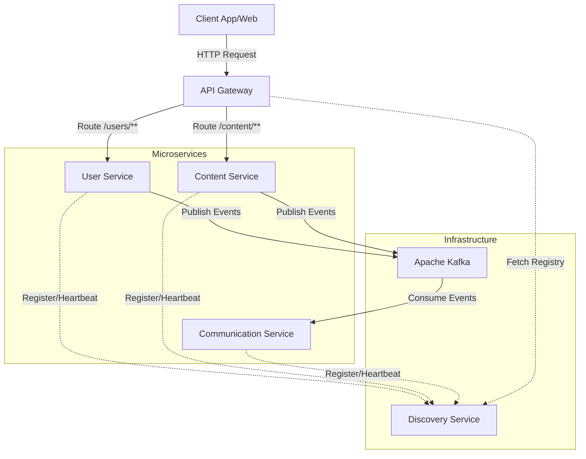
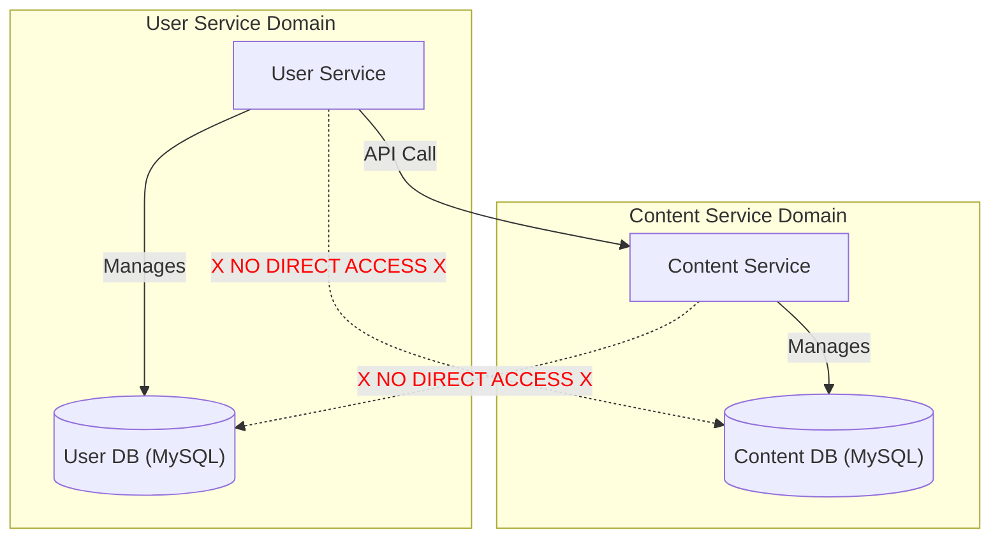

# Proyek Backend Mentora

## 1. Deskripsi Proyek

Proyek ini adalah backend untuk platform **Mentora**, sebuah aplikasi yang dirancang untuk menghubungkan mentor dan mentee. Backend ini dibangun menggunakan arsitektur microservices untuk memastikan skalabilitas, fleksibilitas, dan kemudahan dalam pengembangan dan pemeliharaan.

## 2. Arsitektur

Sistem ini terdiri dari beberapa service independen yang berkomunikasi satu sama lain. Komunikasi antar service dilakukan secara sinkron (melalui API Gateway) dan asinkron (menggunakan Apache Kafka).

### Diagram Arsitektur Sistem



### Arsitektur Database

Proyek ini mengadopsi pola **Database per Service**. Setiap microservice memiliki databasenya sendiri dan bertanggung jawab penuh atas datanya. Service lain tidak diizinkan untuk mengakses database service lain secara langsung. Komunikasi data antar service harus dilakukan melalui API.

Pola ini memberikan keuntungan sebagai berikut:
- **Loose Coupling**: Perubahan skema database di satu service tidak akan secara langsung memengaruhi service lain.
- **Fleksibilitas Teknologi**: Setiap service bebas memilih jenis database yang paling sesuai dengan kebutuhannya (misalnya, SQL untuk data transaksional dan NoSQL untuk data tidak terstruktur).



## 3. Teknologi yang Digunakan

- **Bahasa Pemrograman**: Java
- **Framework**: Spring Boot, Spring Cloud
- **Database**:
    - **User Service**: MySQL
    - **Content Service**: MySQL
- **Messaging**: Apache Kafka
- **Infrastruktur**: Docker
- **Build Tool**: Maven / Gradle (sesuaikan dengan proyek Anda)

## 4. Prasyarat

Sebelum menjalankan proyek, pastikan Anda telah menginstal perangkat lunak berikut:

- **JDK 17** atau yang lebih baru
- **Docker** dan **Docker Compose**
- **Maven 3.8+** atau **Gradle 7.5+**
- **Git**
- **IDE** seperti IntelliJ IDEA atau VS Code
- **MySQL Server** (jika tidak menggunakan Docker untuk database)

## 5. Cara Menjalankan Proyek

### a. Clone Repository

```bash
git clone <URL_REPOSITORY_ANDA>
cd MENTORA/BACKEND
```

### b. Jalankan Infrastruktur Pendukung

Proyek ini menggunakan Apache Kafka yang dijalankan melalui Docker Compose.

```bash
docker-compose up -d
```

Perintah ini akan menjalankan container Kafka di background. *Catatan: Konfigurasi `docker-compose.yml` perlu ditambahkan untuk database MySQL jika ingin menjalankannya dalam container.*

### c. Build Semua Modul

Pastikan Anda membangun modul `mentora-common` terlebih dahulu karena modul lain memiliki dependensi ke modul ini.

```bash
# Build mentora-common
cd mentora-common
mvn clean install

# Kembali ke direktori root
cd ..

# Build semua service lainnya
mvn clean install
```

### d. Jalankan Services

Jalankan setiap service dalam urutan berikut. Anda bisa menjalankannya melalui IDE Anda (direkomendasikan) atau menggunakan perintah `mvn spring-boot:run` di terminal terpisah untuk setiap service.

1.  **discovery-service**: Sebagai service registry, harus berjalan pertama kali.
2.  **api-gateway**: Pintu gerbang utama.
3.  **user-service**: Service untuk manajemen pengguna.
4.  **content-service**: Service untuk manajemen konten.
5.  **communication-service**: Service untuk komunikasi (notifikasi, dll).

Setelah semua service berjalan, aplikasi backend siap menerima permintaan.

## 6. Deskripsi Services

Berikut adalah penjelasan singkat untuk setiap service:

-   `discovery-service`:
    Berperan sebagai Eureka Server atau Consul untuk service registration and discovery. Semua microservice lain akan mendaftarkan diri ke service ini.

-   `api-gateway`:
    Menggunakan Spring Cloud Gateway. Menerapkan routing ke service lain, serta menangani otentikasi, rate limiting, dan logging terpusat.

-   `user-service`:
    Bertanggung jawab untuk semua hal yang berkaitan dengan pengguna, seperti registrasi, login, profil pengguna, dan otentikasi/autorisasi. Mengelola datanya sendiri di database MySQL.

-   `content-service`:
    Mengelola semua konten dalam platform, seperti materi kursus, artikel, video, dan lain-lain. Menggunakan database MySQL.

-   `communication-service`:
    Menangani pengiriman notifikasi, email, atau pesan real-time kepada pengguna. Kemungkinan besar terintegrasi dengan Kafka untuk menerima event.

-   `mentora-common`:
    Sebuah modul pustaka bersama (shared library) yang berisi DTO (Data Transfer Objects), kelas utilitas, atau konfigurasi umum yang digunakan oleh lebih dari satu service.

---
*README ini dibuat secara otomatis berdasarkan struktur proyek. Silakan sesuaikan dan lengkapi detail yang kurang.*